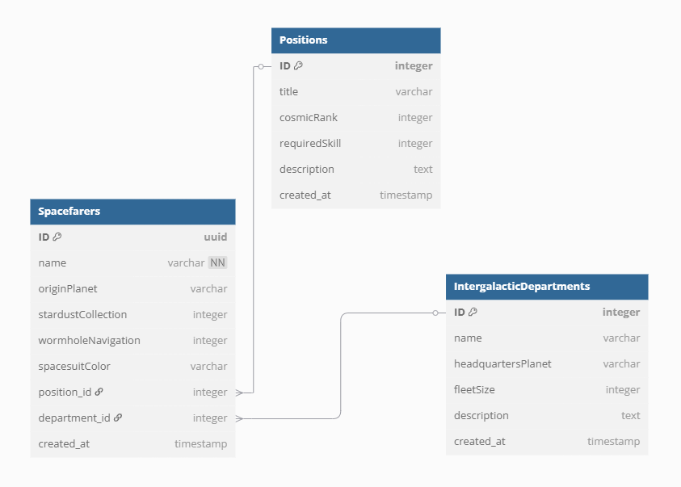

# Welcome to Spacefarers!

---

This is a simple dashboard where the admin user can create, read, update, and delete data displayed on the List Report
Page.

The application uses CAP (Cloud Application Programming) framework, Fiori List Report and Object Page (powered by
SAPUi5), along
with an SQLite database and mocked authentication.

## Data Model

This model represents a galactic Spacefaring organization where Spacefarers are structured within a hierarchical
system.

Each Spacefarer is assigned to one Position, and each Spacefarer belongs to one Intergalactic Department.
(many-to-one relationships)

Additionally, each Spacefarer has attributes such as name, origin planet, stardust collection, spacesuit color, and wormhole navigation
skills.



## Project Setup

### Install dependencies and run project

```
npm i && cds deploy && cds watch
```

### Reinstall project, reset DB

```
rm -fr node_modules/ && rm -fr db.* && npm i && cds deploy && cds watch
```

### Reset DB (redeploy from mock csvs)

```
rm -fr db.* && cds deploy && cds watch
```

### Reinstall Fiori Frontend if needed

```
rm -fr ./app
```

```
npm install -g yo
```

```
npm install -g @sap/generator-fiori
```

```
yo @sap/fiori
```

In the CLI wizard, choose *"List Report Page"* with *"Use a Local CAP Project"*

## Authentication & Authorization

Please use `alice`'s admin credentials, to access the dashboard.

user `dave`, despite having admin privileges, cannot access the dashboard because he resides on a restricted planet.

We are using customized `@sap/cds` provided mock users for authentication.
https://cap.cloud.sap/docs/node.js/authentication#mock-users

## Email notifications

This project uses Nodemailer to send email notifications. It may not work properly while connected to a VPN, so please
disconnect from your VPN client while testing the application.

Email credentials and are generated using Nodemailer’s built-in `createTestAccount()` function.
We are using https://ethereal.email/ as email server provider.

For more information, please check: https://www.nodemailer.com/smtp/testing/

---

Learn more at https://cap.cloud.sap/docs/get-started/
